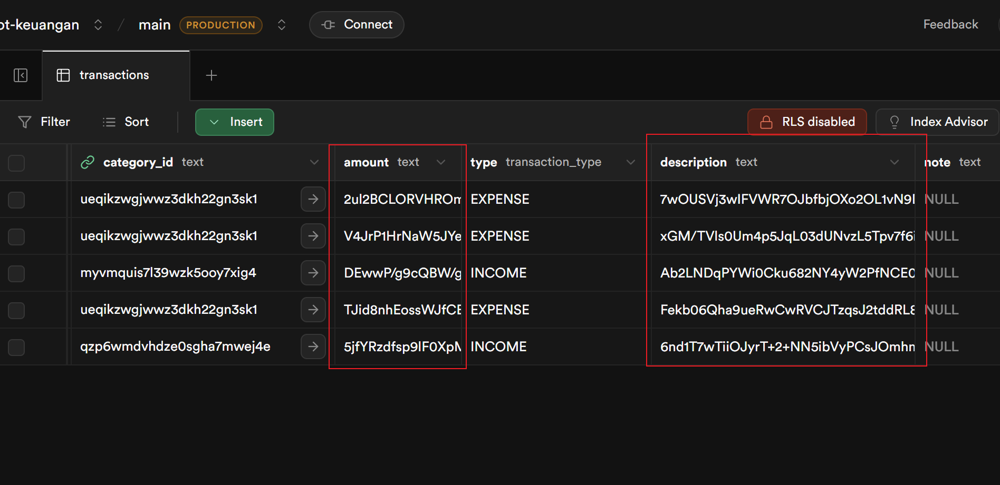

<p align="center">
  
</p>

# Aplikasi Keuangan Cymblot

Aplikasi Keuangan Cymblot adalah aplikasi manajemen keuangan pribadi berbasis web yang membantu Anda mengelola keuangan sehari-hari secara menyeluruh — mulai dari pencatatan transaksi, pengelolaan akun, anggaran bulanan, hingga pelacakan utang/piutang dan transaksi berulang.

## Akses Aplikasi

Anda dapat mengakses aplikasi ini melalui [https://keuangan.fikrisyahid.my.id/](https://keuangan.fikrisyahid.my.id/)

## Fitur Utama

- **Dashboard** — Ringkasan keuangan: total saldo, pemasukan & pengeluaran bulan ini, transaksi terbaru, progres anggaran, dan kategori pengeluaran terbesar.
- **Transaksi** — Catat pemasukan & pengeluaran dengan filter berdasarkan tanggal, akun, kategori, dan kata kunci.
- **Akun** — Kelola berbagai jenis akun keuangan: Tunai, Bank, E-Wallet, Kartu Kredit, dan Investasi.
- **Kategori** — Buat kategori kustom untuk pemasukan maupun pengeluaran, lengkap dengan ikon dan warna.
- **Anggaran** — Tetapkan batas anggaran per kategori per bulan dan pantau realisasinya secara visual.
- **Transaksi Berulang** — Atur transaksi otomatis berulang (harian, mingguan, bulanan, atau tahunan).
- **Utang & Piutang** — Lacak utang (pinjaman dari orang lain) dan piutang (pinjaman ke orang lain) beserta sisa tagihan dan tanggal jatuh tempo.
- **Laporan** — Analisis keuangan visual berupa grafik area, bar chart, dan donut chart untuk periode mingguan, bulanan, atau tahunan.
- **Pengaturan** — Ubah password akun.
- **Enkripsi End-to-End** — Seluruh data keuangan dienkripsi dengan kunci yang diturunkan dari password pengguna (AES-256-GCM). Bahkan admin server tidak dapat membaca data pengguna.

## Privasi & Keamanan Data

Aplikasi ini dirancang dengan prinsip **zero-knowledge encryption** — artinya bahkan pemilik/admin server **tidak dapat membaca** data keuangan pengguna. Semua data sensitif terenkripsi di database.

### Cara Kerja Enkripsi

| Aspek | Detail |
|---|---|
| Algoritma | AES-256-GCM (authenticated encryption) |
| Key Derivation | PBKDF2 dengan 600.000 iterasi |
| Kunci Enkripsi | Diturunkan dari password pengguna (per-user key) |
| API | Web Crypto API (kompatibel Edge Runtime) |

### Alur Enkripsi

1. **Saat Register** — Sistem men-generate salt unik dan menurunkan encryption key dari password pengguna menggunakan PBKDF2. Sebuah verifier disimpan untuk validasi key saat login.
2. **Saat Login** — Password digunakan untuk menurunkan kembali encryption key yang sama. Key ini disimpan dalam encrypted cookie (bukan di database) selama sesi aktif.
3. **Saat Menyimpan Data** — Semua data sensitif (nama akun, saldo, jumlah transaksi, deskripsi, nama kategori, dll.) dienkripsi dengan AES-256-GCM sebelum disimpan ke database.
4. **Saat Membaca Data** — Data didekripsi di server menggunakan encryption key dari cookie, lalu dikirim ke browser dalam bentuk plaintext.
5. **Saat Ubah Password** — Seluruh data didekripsi dengan key lama, lalu di-re-enkripsi dengan key baru yang diturunkan dari password baru.

### Data yang Dienkripsi

- Nama dan saldo akun keuangan
- Jumlah, deskripsi, dan catatan transaksi
- Nama kategori
- Jumlah anggaran
- Jumlah dan deskripsi transaksi berulang
- Nama, jumlah, sisa, dan deskripsi utang/piutang

### Catatan Penting

- **Lupa password = kehilangan data.** Karena kunci enkripsi diturunkan dari password, tidak ada cara untuk memulihkan data jika password hilang.
- Data yang tersimpan di database berupa ciphertext yang tidak bisa dibaca tanpa kunci yang benar.
- Setiap pengguna memiliki kunci enkripsi berbeda, sehingga kompromi satu akun tidak mempengaruhi akun lain.

### Bukti Enkripsi Database

Berikut tampilan data di database — semua kolom sensitif berupa ciphertext yang tidak terbaca tanpa kunci enkripsi pengguna:

<p align="center">
  
</p>

## Teknologi yang Digunakan

| Kategori | Teknologi |
|---|---|
| Framework | Next.js 16 (App Router, Server Actions) |
| UI | Mantine UI v8, Tabler Icons |
| Chart | Mantine Charts (Recharts) |
| ORM | Drizzle ORM |
| Database | PostgreSQL (Supabase) |
| Auth | JWT (jose) + cookie session |
| Bahasa | TypeScript |
| Package Manager | Bun (default) |

## Struktur Database

Aplikasi menggunakan PostgreSQL dengan skema berikut:

- **users** — Data pengguna (email, password hash, nama)
- **accounts** — Akun keuangan milik pengguna
- **categories** — Kategori transaksi (pemasukan/pengeluaran)
- **transactions** — Catatan transaksi keuangan
- **tags** — Tag untuk transaksi (many-to-many)
- **budgets** — Anggaran per kategori per bulan
- **recurring_transactions** — Transaksi berulang terjadwal
- **debts** — Catatan utang dan piutang

## Cara Install

1. Clone repository ini:

   ```bash
   git clone https://github.com/fs3120/cymblot-keuangan.git
   ```

2. Masuk ke direktori projek:

   ```bash
   cd cymblot-keuangan
   ```

3. Buat file `.env.local` dan isi variabel berikut:

   ```env
   DATABASE_URL=postgresql://...
   JWT_SECRET=your-secret-key
   ```

4. Install dependencies:

   ```bash
   bun install
   ```

   atau dengan `npm`:

   ```bash
   npm install
   ```

5. Generate dan jalankan migrasi database:

   ```bash
   bun run db:generate
   bun run db:migrate
   ```

   atau dengan `npm`:

   ```bash
   npm run db:generate
   npm run db:migrate
   ```

6. Jalankan aplikasi:

   ```bash
   bun run dev
   ```

   atau:

   ```bash
   npm run dev
   ```

## Scripts yang Tersedia

| Script | Perintah | Keterangan |
|---|---|---|
| `dev` | `next dev` | Jalankan server development |
| `build` | generate + migrate + build | Build untuk production |
| `start` | `next start` | Jalankan server production |
| `db:generate` | `drizzle-kit generate` | Generate file migrasi dari schema |
| `db:migrate` | `drizzle-kit migrate` | Jalankan migrasi ke database |
| `db:push` | `drizzle-kit push` | Push schema langsung ke database |
| `db:studio` | `drizzle-kit studio` | Buka Drizzle Studio (GUI database) |

## Kontribusi

Jika Anda tertarik untuk berkontribusi dalam pengembangan aplikasi ini, ikuti langkah-langkah berikut:

1. Fork repository ini.
2. Buat branch baru dengan nama yang deskriptif: `git checkout -b fitur-baru`.
3. Setelah selesai, buat pull request agar perubahan Anda bisa direview dan di-merge ke dalam repository utama.

## Lisensi

Aplikasi ini dilisensikan di bawah [MIT License](https://github.com/fs3120/cymblot-keuangan/blob/2.0/LICENSE.md)